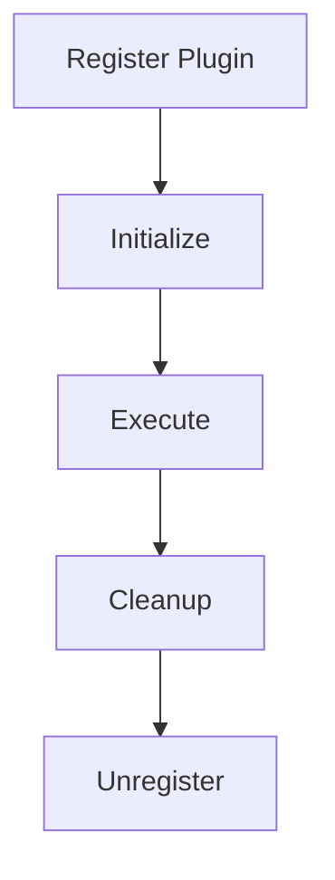

# Plugins API Reference

The Plugins API allows you to extend the core functionality of our platform with custom integrations and features.

## Plugin Architecture

Plugins are standalone modules that can be registered with the main application. Each plugin has:

- A unique identifier
- A set of permissions
- Initialization and cleanup hooks
- Custom functionality

## Plugin Lifecycle



## Plugin Registration

To register a plugin, use the `/plugins/register` endpoint:

```http
POST /plugins/register HTTP/1.1
Host: api.example.com
Authorization: Bearer YOUR_API_KEY
Content-Type: application/json

{
  "name": "my-custom-plugin",
  "version": "1.0.0",
  "description": "Custom plugin for data processing",
  "entry_point": "https://plugins.example.com/my-plugin/init",
  "permissions": ["read:data", "process:data"]
}
```

## Plugin Endpoints

| Endpoint | Method | Description |
|----------|--------|-------------|
| `/plugins` | GET | List all plugins |
| `/plugins/{id}` | GET | Get plugin details |
| `/plugins/register` | POST | Register a new plugin |
| `/plugins/{id}/enable` | PUT | Enable a plugin |
| `/plugins/{id}/disable` | PUT | Disable a plugin |
| `/plugins/{id}` | DELETE | Unregister a plugin |

## Building Plugins

### Plugin Manifest

Every plugin requires a manifest file that defines its properties:

```json
{
  "name": "data-processor",
  "version": "1.2.0",
  "description": "Processes data using custom algorithms",
  "author": "Example, Inc.",
  "website": "https://example.com/plugins/data-processor",
  "main": "index.js",
  "hooks": {
    "init": "onInit",
    "process": "onProcess",
    "cleanup": "onCleanup"
  },
  "permissions": [
    "read:data",
    "write:data",
    "process:data"
  ]
}
```

### Plugin Code Example

Here's a simple example of a plugin implementation:

```javascript
// Plugin implementation
class DataProcessorPlugin {
  onInit(context) {
    console.log('Plugin initialized with context:', context);
    this.config = context.config;
    return { status: 'success' };
  }
  
  onProcess(data) {
    // Process the data
    const processed = data.map(item => ({
      ...item,
      processed: true,
      timestamp: new Date().toISOString()
    }));
    
    return processed;
  }
  
  onCleanup() {
    console.log('Plugin cleanup');
    // Release resources
    return { status: 'success' };
  }
}

// Export the plugin
module.exports = new DataProcessorPlugin();
```

## Security Considerations

- Plugins run with limited permissions
- All plugin code is sandboxed
- API keys with plugin permissions are required
- Plugins undergo a security review before being published to the marketplace 